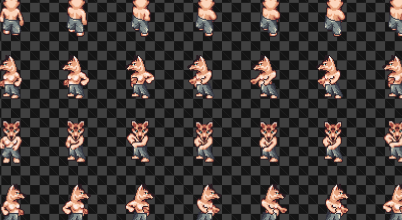
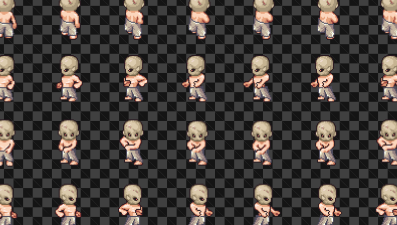

# lpcg - Liberated Pixel Cup Generator

This repository offer a lib and binaries to generate character spritesheets based on [LPC](https://lpc.opengameart.org).

## Description

Take multiple layer identifier as input and produce merge of these as output. Order of layers is important.

## General usage

Globally, binaries or lib objects take layer identifiers like this :

    body::bodies::female::fur_tan head::heads::rabbit::fur_tan

This means we want to merge `body/bodies/female/fur_tan.png` file, then `head/heads/rabbit/fur_tan.png` file.

A random file selection can be set with `*` like this :

    body::bodies::female::fur_tan head::heads::rabbit::*

A *variant* can be given (eg. `body::bodies::*(light)`). In this case, if folder contain the variant image, it is selected instead other files.

## Example

Following layer identifiers with *light* variant produce for example :

    body::bodies::*(light) head::heads::*(light) legs::pantaloons::*(light)

**build 1** :


**build 2** :



**build 3** :



## As Rust lib

Use `input::Input` to represent layers and `builder::Builder` to build the output image.

There is a rapid example :

```rust
use std::path::PathBuf;
use lpcg::{builder::Builder, input::Input};

fn main() -> Result<(), String> {
    let input = match Input::from_str("body::bodies::female::fur_tan head::heads::rabbit::fur_tan").unwrap();
    let image = Builder::new(PathBuf::from("./spritesheets")).build(input).unwrap();
    image.save(&PathBuf::from("./out.png")).unwrap();
}
```

Where `None` can be the variant, like `Some("light")`.

## As CLI binary

Image build example usage : 

    lpcg-build ./spritesheets "body::bodies::*(light)" "head::heads::*(light)" "legs::pantaloons::*" out.png

## Add new spritesheets

The `spritesheets` repository folder is build from [Universal-LPC-Spritesheet-Character-Generator](https://github.com/sanderfrenken/Universal-LPC-Spritesheet-Character-Generator) by importing images with [import_from_ulpcscg.py](import_from_ulpcscg.py) script.

When new sprite sheets are added to (https://github.com/sanderfrenken/Universal-LPC-Spritesheet-Character-Generator), execute [import_from_ulpcscg.py](import_from_ulpcscg.py) will add new ones with following rules :

 * Copy only .png files which are 832x1344 dimension
 * Copy only `universal` folder content when exists

`CREDITS.txt` will be updated automatically.

## Credits

All art distributed with this project (all images in the `spritesheets` subdirectory) is licensed under the [GNU GPL 3.0](http://www.gnu.org/licenses/gpl-3.0.html) ([text](gpl-3_0.txt)) and/or [Creative Commons Attribution-ShareAlike 3.0](http://creativecommons.org/licenses/by-sa/3.0/) ([text](cc-by-sa-3_0.txt)) license(s). Some art may be available under other licenses too.

The file `CREDITS.csv` lists the authors, license(s), and links to the original URL(s), for each image in `spritesheets`. **If you generate a sprite using this tool, you must credit all the authors**. You can do this one of two ways:

- Distribute the entire `CREDITS.csv` file along with your project.
- Based on the layers you use the generator outputs the used spritesheets and their credits to a textfield. You are also enabled here to download this text as csv or txt straight to your machiness.

Either way, make sure this credits file is accessible from within your game or app and can be reasonably discovered by users (for instance, show the information on the "Credits" screen directly, or provide a visible link). If you don't want to *show* the entire credits file directly, should include a statement like this on your credits screen:

> Sprites by: Johannes Sjölund (wulax), Michael Whitlock (bigbeargames), Matthew Krohn (makrohn), Nila122, David Conway Jr. (JaidynReiman), Carlo Enrico Victoria (Nemisys), Thane Brimhall (pennomi), bluecarrot16, Luke Mehl, Benjamin K. Smith (BenCreating), ElizaWy, MuffinElZangano, Durrani, kheftel, Stephen Challener (Redshrike), TheraHedwig, Evert, Pierre Vigier (pvigier), Eliza Wyatt (ElizaWy), Johannes Sj?lund (wulax), Sander Frenken (castelonia), dalonedrau, Lanea Zimmerman (Sharm), laetissima, kirts, Mark Weyer, Joe White, Mandi Paugh, William.Thompsonj, Manuel Riecke (MrBeast), Barbara Riviera, thecilekli, Yamilian, Fabzy, Skorpio, Radomir Dopieralski, Emilio J. Sanchez-Sierra, kcilds/Rocetti/Eredah, Cobra Hubbard (BlueVortexGames), DCSS authors, Marcel van de Steeg (MadMarcel), DarkwallLKE, Charles Sanchez (CharlesGabriel), Shaun Williams, Tuomo Untinen (reemax), Stafford McIntyre, PlatForge project, Tracy, Daniel Eddeland (daneeklu), William.Thomsponj, Joshua Taylor, Zi Ye, AntumDeluge, drjamgo@hotmail.com, Lori Angela Nagel (jastiv), gr3yh47, pswerlang, XOR, tskaufma, Inboxninja, Dr. Jamgo, LordNeo
> Sprites contributed as part of the Liberated Pixel Cup project from OpenGameArt.org: http://opengameart.org/content/lpc-collection
> License: Creative Commons Attribution-ShareAlike 3.0 (CC-BY-SA 3.0) <http://creativecommons.org/licenses/by-sa/3.0/>
> Detailed credits: See CREDITS.csv file